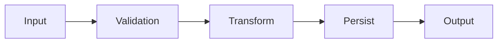
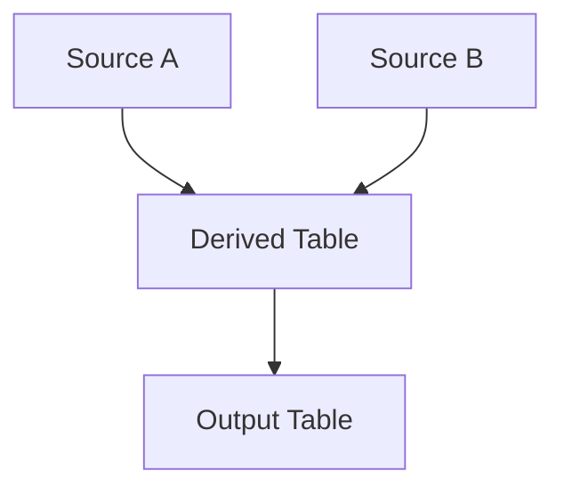
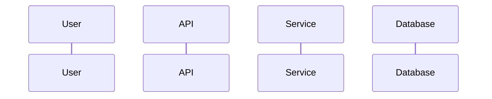
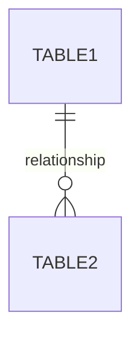

# RESEARCH: Comprehensive documentation framework with reverse engineering workflow and audience translation templates delivered.

**Agent:** default
**Completed:** 2026:01:22:153029

---

## Agent Output

Now I have the context needed. Let me design the comprehensive framework for codebase reverse engineering and multi-audience documentation.

---

## SUMMARY: Designing comprehensive codebase reverse engineering and multi-audience documentation framework for xConnect IDE

## ANALYSIS: This framework addresses a fundamental challenge in engineering work - understanding existing codebases and communicating that understanding to audiences ranging from AI tools to C-level executives. The key insight is that documentation is not one thing - it's a translation layer between technical reality and human understanding at different abstraction levels.

## ACTIONS: Designing six interconnected processes: reverse engineering workflow, documentation taxonomy, audience profiles, translation templates, tooling requirements, and quality criteria.

## RESULTS: Complete framework follows below.

---

# XCONNECT IDE: CODEBASE REVERSE ENGINEERING AND MULTI-AUDIENCE DOCUMENTATION FRAMEWORK

## 1. REVERSE ENGINEERING WORKFLOW

### Phase 1: ORIENTATION (30 minutes)

**Goal:** Establish mental model before diving into code.

```
1.1 BOUNDARY IDENTIFICATION
    - What is this codebase responsible for?
    - What is explicitly OUT of scope?
    - What systems does it interface with?

1.2 ENTRY POINT DISCOVERY
    - Main entry files (main.ts, index.ts, App.tsx, etc.)
    - Configuration files (package.json, tsconfig.json, etc.)
    - Schema definitions (SQL, GraphQL, OpenAPI, etc.)
    - Environment/deployment files

1.3 DOCUMENTATION SURVEY (even if outdated)
    - README.md
    - ARCHITECTURE.md or similar
    - API docs
    - Inline comments in critical files
```

**xConnect-Specific:**
```
- Pipeline entry points (orchestration files)
- Step definitions directory
- Query library location
- Connection/credential configuration
- Scheduling/trigger definitions
```

### Phase 2: STRUCTURE MAPPING (1-2 hours)

**Goal:** Understand the skeleton before the flesh.

```
2.1 DIRECTORY TOPOLOGY
    - Generate directory tree (depth 3)
    - Identify organizational pattern:
      - Feature-based (features/, modules/)
      - Layer-based (controllers/, services/, models/)
      - Hybrid
    - Note any anomalies or inconsistencies

2.2 DEPENDENCY GRAPH (External)
    - Package dependencies (npm, pip, etc.)
    - External services (APIs, databases, queues)
    - Shared libraries (internal packages)

2.3 DEPENDENCY GRAPH (Internal)
    - Which modules import which?
    - What are the "hubs" (most imported)?
    - What are the "leaves" (import nothing)?
    - Are there circular dependencies?
```

**Output Artifact: STRUCTURE_MAP.md**
```markdown
# [Codebase Name] Structure Map

## Directory Organization
[Tree diagram]

## Organizational Pattern
[Pattern name + evidence]

## External Dependencies
| Dependency | Purpose | Critical? |
|------------|---------|-----------|

## Internal Module Graph
[Mermaid diagram]

## Key Observations
- [Observation 1]
- [Observation 2]
```

### Phase 3: DATA FLOW TRACING (2-4 hours)

**Goal:** Follow the data from input to output.

```
3.1 DATA ENTRY POINTS
    - User input (forms, CLI args)
    - API endpoints (REST, GraphQL)
    - File uploads
    - Database reads
    - Message queue consumption
    - Scheduled triggers

3.2 DATA EXIT POINTS
    - API responses
    - Database writes
    - File outputs
    - Message queue publishing
    - External API calls
    - Logs/metrics

3.3 DATA TRANSFORMATION CHAIN
    For each significant data flow:
    - Entry point
    - Validation/parsing layer
    - Business logic transformations
    - Persistence layer
    - Exit point
```

**xConnect-Specific:**
```
3.4 TABLE LINEAGE
    For each output table:
    - Source tables (direct)
    - Source tables (indirect/derived)
    - Transformation logic
    - Freshness requirements
    - Quality checks

3.5 PIPELINE DATA FLOW
    - Input datasets
    - Intermediate datasets
    - Output datasets
    - Side effects (logging, metrics, alerts)
```

**Output Artifact: DATA_FLOW.md**
```markdown
# [Codebase Name] Data Flow

## Entry Points
| Point | Type | Data Shape | Volume |
|-------|------|------------|--------|

## Exit Points
| Point | Type | Data Shape | Destination |
|-------|------|------------|-------------|

## Primary Data Flows

### Flow: [Name]


### Table Lineage (if applicable)

```

### Phase 4: CONTROL FLOW ANALYSIS (2-4 hours)

**Goal:** Understand the logic paths and decision trees.

```
4.1 HAPPY PATH TRACING
    - Trace the "normal" execution path
    - Identify expected inputs and outputs
    - Note any assumptions made

4.2 ERROR PATH TRACING
    - Where are errors caught?
    - What error types exist?
    - How do errors propagate?
    - Are there retry mechanisms?

4.3 CONDITIONAL LOGIC MAPPING
    - Feature flags
    - Environment-based behavior
    - User/tenant-specific logic
    - A/B testing branches

4.4 STATE MACHINE IDENTIFICATION
    - What entities have state?
    - What are the valid state transitions?
    - What triggers transitions?
```

**xConnect-Specific:**
```
4.5 PIPELINE CONTROL FLOW
    - Step execution order
    - Conditional step execution
    - Parallel vs sequential execution
    - Retry and failure handling
    - Dependency resolution
```

**Output Artifact: CONTROL_FLOW.md**
```markdown
# [Codebase Name] Control Flow

## Happy Path


## Error Handling Strategy
[Narrative description]

## State Machines
[Diagram per entity with states]

## Feature Flags / Conditional Logic
| Flag | Purpose | Default | Affects |
|------|---------|---------|---------|
```

### Phase 5: PATTERN RECOGNITION (1-2 hours)

**Goal:** Identify recurring patterns and architectural decisions.

```
5.1 ARCHITECTURAL PATTERNS
    - MVC/MVVM/etc.
    - Microservices vs monolith
    - Event sourcing
    - CQRS
    - Repository pattern
    - Factory pattern
    - etc.

5.2 CODE PATTERNS
    - Error handling conventions
    - Logging conventions
    - Testing patterns
    - Configuration patterns
    - Authentication/authorization patterns

5.3 ANTI-PATTERNS (be diplomatic)
    - God classes/files
    - Circular dependencies
    - Magic strings/numbers
    - Copy-paste code
    - Dead code
```

**Output Artifact: PATTERNS.md**
```markdown
# [Codebase Name] Patterns

## Architectural Patterns
| Pattern | Evidence | Quality |
|---------|----------|---------|

## Code Conventions
[List with examples]

## Areas for Improvement
[Diplomatically phrased observations]
```

### Phase 6: ASSUMPTION EXTRACTION (1 hour)

**Goal:** Make implicit knowledge explicit.

```
6.1 ENVIRONMENTAL ASSUMPTIONS
    - Required environment variables
    - Expected file system structure
    - Network requirements
    - Hardware requirements

6.2 DATA ASSUMPTIONS
    - Expected data formats
    - Assumed data quality
    - Volume expectations
    - Freshness requirements

6.3 BEHAVIORAL ASSUMPTIONS
    - Expected user behavior
    - Expected system behavior
    - Timing assumptions (timeouts, SLAs)

6.4 BUSINESS RULE ASSUMPTIONS
    - Embedded business logic
    - Hardcoded rules
    - Implicit domain knowledge
```

**Output Artifact: ASSUMPTIONS.md**
```markdown
# [Codebase Name] Implicit Assumptions

## CRITICAL (system fails without these)
- [Assumption + location in code]

## IMPORTANT (degraded behavior without these)
- [Assumption + location in code]

## MINOR (edge cases affected)
- [Assumption + location in code]
```

### Phase 7: RISK IDENTIFICATION (1 hour)

**Goal:** Identify fragile points and potential failure modes.

```
7.1 SINGLE POINTS OF FAILURE
    - Components without redundancy
    - Single-threaded bottlenecks
    - Shared resources

7.2 SECURITY CONCERNS
    - Authentication gaps
    - Authorization gaps
    - Input validation gaps
    - Secrets management

7.3 SCALABILITY CONCERNS
    - N+1 queries
    - Memory accumulation
    - Connection exhaustion
    - Lock contention

7.4 MAINTAINABILITY CONCERNS
    - Complex functions (cyclomatic complexity)
    - Long files
    - Undocumented logic
    - Test coverage gaps
```

**Output Artifact: RISK_ASSESSMENT.md**
```markdown
# [Codebase Name] Risk Assessment

## Critical Risks
| Risk | Location | Impact | Mitigation |
|------|----------|--------|------------|

## Moderate Risks
| Risk | Location | Impact | Mitigation |
|------|----------|--------|------------|

## Low Risks
| Risk | Location | Impact | Mitigation |
|------|----------|--------|------------|
```

---

## 2. TECHNICAL DOCUMENTATION TAXONOMY

### Documentation Type Matrix

| Type | Purpose | Audience | Update Frequency | Format |
|------|---------|----------|------------------|--------|
| **Reference** | Look up specific information | All technical | As code changes | Structured data |
| **Conceptual** | Understand the "why" | New team members | Rarely | Narrative |
| **Procedural** | Complete a specific task | Operators | As processes change | Step-by-step |
| **Tutorial** | Learn by doing | Newcomers | Rarely | Guided exercise |
| **ADR** | Record decision rationale | Future maintainers | Never (immutable) | Template |
| **Runbook** | Handle operational scenarios | On-call | As system changes | Playbook |

### Reference Documentation

**API Reference:**
```markdown
# [Endpoint/Function Name]

## Purpose
[One sentence]

## Signature
```[language]
functionName(param1: Type, param2: Type): ReturnType
```

## Parameters
| Name | Type | Required | Default | Description |
|------|------|----------|---------|-------------|

## Returns
[Description with type]

## Errors
| Code | Condition | Recovery |
|------|-----------|----------|

## Example
```[language]
// Example usage
```

## Notes
[Edge cases, gotchas, performance considerations]
```

**Schema Reference:**
```markdown
# [Table/Schema Name]

## Purpose
[One sentence]

## Schema
| Column | Type | Nullable | Default | Description |
|--------|------|----------|---------|-------------|

## Relationships


## Indexes
| Name | Columns | Type | Purpose |
|------|---------|------|---------|

## Constraints
[Business rules enforced at schema level]

## Sample Data
[Representative examples]
```

### Conceptual Documentation

**Architecture Overview:**
```markdown
# [System Name] Architecture

## Purpose
[What problem does this system solve?]

## Principles
1. [Guiding principle 1]
2. [Guiding principle 2]

## High-Level Design
```mermaid
C4Context
    [Diagram]
```

## Components
| Component | Responsibility | Interfaces |
|-----------|---------------|------------|

## Data Flow
[Narrative + diagrams]

## Trade-offs
| Decision | Alternatives Considered | Why This Choice |
|----------|------------------------|-----------------|

## Evolution
[How has this architecture changed? Why?]
```

### Procedural Documentation

**Pipeline Documentation (xConnect-specific):**
```markdown
# [Pipeline Name]

## Purpose
[Business outcome this pipeline produces]

## Schedule
[Cron expression + human-readable]

## Dependencies
| Type | Name | Required | Fallback |
|------|------|----------|----------|

## Steps

### Step 1: [Name]
- **Purpose:** [What this step does]
- **Input:** [Data source]
- **Output:** [Data destination]
- **Query:** [Link or inline]
- **Edge Cases:** [What could go wrong]

### Step 2: [Name]
[Same structure]

## Failure Modes
| Scenario | Detection | Recovery |
|----------|-----------|----------|

## Monitoring
- **Success Metric:** [What indicates success]
- **Alert Threshold:** [When to alert]
- **Dashboard:** [Link]

## Runbook Links
- [On failure](#)
- [On data quality issue](#)
```

### Decision Documentation (ADR)

**Architecture Decision Record:**
```markdown
# ADR-[NUMBER]: [TITLE]

## Status
[Proposed | Accepted | Deprecated | Superseded by ADR-X]

## Context
[What is the issue that we're seeing that is motivating this decision?]

## Decision
[What is the change that we're proposing and/or doing?]

## Consequences
### Positive
- [Benefit 1]

### Negative
- [Cost/risk 1]

### Neutral
- [Observation 1]

## Alternatives Considered
| Alternative | Pros | Cons | Why Rejected |
|-------------|------|------|--------------|

## References
- [Link to relevant discussion]
- [Link to prototype]
```

### Runbook Documentation

**Operational Runbook:**
```markdown
# Runbook: [Scenario Name]

## Trigger
[What conditions indicate this runbook should be used]

## Severity
[Critical | High | Medium | Low]

## Time to Resolution (Expected)
[15 minutes | 1 hour | etc.]

## Prerequisites
- [ ] [Access/permission needed]
- [ ] [Tool needed]

## Steps

### 1. Diagnose
```bash
# Commands to understand the situation
```
Expected output: [What you should see]

### 2. Mitigate
```bash
# Commands to stop the bleeding
```
Success indicator: [How to know it worked]

### 3. Resolve
```bash
# Commands to fix the root cause
```

### 4. Verify
```bash
# Commands to confirm resolution
```

## Escalation
If unresolved after [time], contact:
- [Person/team + contact method]

## Post-Incident
- [ ] Create incident report
- [ ] Update this runbook if needed
- [ ] Consider preventive measures
```

---

## 3. AUDIENCE PROFILES

### Profile: FUTURE SELF / AI TOOLS (Delegation)

**What They Care About:**
- Complete context (no assumptions about prior knowledge)
- Exact file paths and line numbers
- Gotchas and edge cases
- Why decisions were made
- What was tried and didn't work

**Format Preferences:**
- Code comments
- Markdown with code blocks
- YAML/JSON structured data
- Links to specific file locations

**Detail Level:** MAXIMUM

**Vocabulary:**
- Full technical terminology
- Exact type signatures
- Precise error messages
- Include "magic" values and their sources

**Length:** No limit. More is better.

**Frequency:** Continuous (as you work)

**Medium:** Inline comments, session capture, continuation files

**Template: DELEGATION_BRIEF.md**
```markdown
# Task: [Name]

## Context
[Everything needed to understand this task with zero prior knowledge]

## Current State
- Files involved: [absolute paths]
- Relevant code: [with line numbers]
- Known issues: [list]

## Goal
[Precise success criteria]

## Approach
[Step-by-step plan]

## Gotchas
- [Thing that looks obvious but isn't]
- [Thing that will break if done wrong]

## Resources
- [Link to relevant doc]
- [Link to related code]

## If Stuck
- [Debug approach 1]
- [Who to ask]
```

---

### Profile: TECHNICAL PEERS (Collaboration)

**What They Care About:**
- Architecture decisions and trade-offs
- Interface contracts
- Integration points
- Performance characteristics
- Where they need to be careful

**Format Preferences:**
- Design documents
- ADRs
- Architecture diagrams
- Code review comments

**Detail Level:** HIGH (but focused)

**Vocabulary:**
- Industry-standard terminology
- Pattern names
- No need to explain basics
- Can use acronyms (with first-use expansion)

**Length:** 1-5 pages depending on complexity

**Frequency:** Per feature/change

**Medium:** Docs, PRs, design reviews

**Template: DESIGN_DOC.md**
```markdown
# Design: [Feature Name]

## Overview
[2-3 sentence summary]

## Problem Statement
[What problem are we solving? Why now?]

## Proposed Solution
[High-level approach]

## Design Details

### [Component 1]
[Details with diagrams]

### [Component 2]
[Details with diagrams]

## Interfaces
[APIs, contracts, schemas]

## Trade-offs
| Option | Pros | Cons |
|--------|------|------|

## Risks
[What could go wrong]

## Testing Strategy
[How to validate]

## Rollout Plan
[How to deploy safely]

## Open Questions
[Decisions still needed]
```

---

### Profile: TECHNICAL LEADERS (Manager's Manager, Tech Leads)

**What They Care About:**
- Impact on system health
- Resource requirements
- Timeline and dependencies
- Risks and mitigations
- Alignment with roadmap

**Format Preferences:**
- Executive summaries with optional deep-dives
- Bullet points
- Diagrams (high-level)
- Status indicators (RAG)

**Detail Level:** MEDIUM

**Vocabulary:**
- Technical terms allowed but not assumed
- Translate implementation details to outcomes
- Avoid jargon, use plain language where possible

**Length:** 1 page summary, appendix for details

**Frequency:** Weekly/sprint-based

**Medium:** Confluence, Notion, email

**Template: TECHNICAL_SUMMARY.md**
```markdown
# [Project Name] Technical Summary

## Status: [GREEN/YELLOW/RED]

## Summary
[3 sentences: What, Why, Impact]

## Key Decisions
1. [Decision + rationale]
2. [Decision + rationale]

## Architecture Impact
[One paragraph + simple diagram if needed]

## Risks & Mitigations
| Risk | Impact | Likelihood | Mitigation |
|------|--------|------------|------------|

## Resource Requirements
[People, infrastructure, time]

## Dependencies
[What we're waiting on or what's waiting on us]

## Next Steps
1. [Action + owner + date]
2. [Action + owner + date]

---
*Detailed design: [link]*
```

---

### Profile: DIRECT SUPERVISOR

**What They Care About:**
- Progress against commitments
- Blockers they can help with
- Risks to timeline
- Resource needs
- Quality of work

**Format Preferences:**
- Status updates
- Bullet points
- Task lists with completion %
- Brief explanations

**Detail Level:** LOW-MEDIUM

**Vocabulary:**
- Mix of technical and business terms
- Explain technical concepts briefly
- Focus on outcomes, not implementation

**Length:** Half page

**Frequency:** Daily/weekly

**Medium:** Slack, email, standup

**Template: STATUS_UPDATE.md**
```markdown
# Status Update: [Date]

## Completed
- [Task] - [Outcome/impact]
- [Task] - [Outcome/impact]

## In Progress
- [Task] - [% complete, ETA]
- [Task] - [% complete, ETA]

## Blockers
- [Blocker] - [What I need to unblock]

## Risks
- [Risk] - [Impact if realized]

## Asks
- [Specific request + urgency]

## Next Week Focus
1. [Priority 1]
2. [Priority 2]
```

---

### Profile: VP LEVEL

**What They Care About:**
- Business outcomes
- Resource efficiency
- Risk to business objectives
- Cross-team dependencies
- Strategic alignment

**Format Preferences:**
- Bullet points
- Metrics
- RAG status
- One-pagers

**Detail Level:** LOW

**Vocabulary:**
- Business language
- No unexplained technical terms
- Translate tech to business impact
- Numbers > words

**Length:** Half page maximum

**Frequency:** Monthly/quarterly

**Medium:** Slides, dashboards, brief docs

**Template: VP_BRIEF.md**
```markdown
# [Initiative Name]

**Status:** [On Track / At Risk / Off Track]

**Business Impact:** [One sentence - revenue, cost, risk]

## Key Metrics
| Metric | Target | Current | Trend |
|--------|--------|---------|-------|

## Summary
[3 bullet points maximum]

## Risks
- [Risk + business impact + mitigation]

## Resource Status
[On budget/ahead/behind + why]

## Decisions Needed
- [Decision + deadline + consequence of delay]
```

---

### Profile: C-LEVEL

**What They Care About:**
- Strategic value
- ROI / TCO
- Competitive advantage
- Risk to business
- Board-reportable progress

**Format Preferences:**
- One-pager
- Visual dashboards
- Verbal briefing with backup doc
- Extreme brevity

**Detail Level:** MINIMAL

**Vocabulary:**
- Pure business language
- Zero technical terms without translation
- Analogies to familiar concepts
- Money, time, risk, opportunity

**Length:** One page maximum, ideally less

**Frequency:** Quarterly or milestone-based

**Medium:** Slides, one-pager, verbal

**Template: EXECUTIVE_BRIEF.md**
```markdown
# [Initiative] Executive Brief

## The Headline
[One sentence: What's happening and why it matters]

## Business Impact
[One sentence: Revenue, cost, or risk number]

## Status
[One word + one sentence explanation]

## What's Needed
[One ask, if any]

---
*Contact: [Name] | Full details: [link]*
```

---

## 4. TRANSLATION TEMPLATES

### Technical to Business Translation Matrix

| Technical Concept | Supervisor Translation | VP Translation | C-Level Translation |
|-------------------|----------------------|----------------|---------------------|
| "Refactoring the data pipeline" | "Improving reliability of our data processing" | "Reducing operational risk and future maintenance cost" | "Protecting data quality that drives $X decisions" |
| "Adding retry logic" | "Making the system recover automatically from failures" | "Reducing on-call burden and incident frequency" | "Improving system reliability to 99.X%" |
| "Migrating to new database" | "Moving to faster, more reliable storage" | "Reducing infrastructure cost by X% while improving performance" | "Modernizing infrastructure to support 3x growth" |
| "Fixing N+1 query" | "Speeding up page load time" | "Improving user experience, reducing churn risk" | "Faster product = happier customers" |
| "Technical debt paydown" | "Fixing issues that slow us down" | "Investing in velocity to deliver more next quarter" | "Removing drag on engineering productivity" |

### Translation Workflow

```
1. EXTRACT CORE FACTS
   - What changed?
   - What problem does it solve?
   - What's the measurable outcome?

2. IDENTIFY AUDIENCE CONCERNS
   - Use audience profile to determine what they care about
   - Map technical facts to those concerns

3. TRANSLATE VOCABULARY
   - Replace technical terms with audience-appropriate terms
   - Keep precision appropriate to detail level

4. ADJUST GRANULARITY
   - Delegation: Keep all details
   - Peers: Keep architectural details
   - Leaders: Keep outcome details
   - Executives: Keep only strategic details

5. FORMAT FOR MEDIUM
   - Adjust length, structure, and visual elements
   - Match audience's consumption pattern
```

### Example Translation: Pipeline Improvement

**Raw Technical:**
```
Implemented connection pooling in the ETL pipeline, replacing 
per-query connections. Added exponential backoff retry logic 
with jitter. Refactored the main orchestration loop to use 
async/await instead of callbacks. Fixed a race condition in 
the checkpoint system.
```

**For Future Self / AI:**
```markdown
## Pipeline Reliability Improvements (2024-01-22)

### Changes Made

1. **Connection Pooling** (`/src/db/pool.ts`)
   - Replaced per-query connections with pg-pool
   - Pool size: 10 connections (tuned for our workload)
   - Idle timeout: 30s
   - Why: Was hitting connection limits during peak load

2. **Retry Logic** (`/src/utils/retry.ts`)
   - Exponential backoff: 100ms, 200ms, 400ms, 800ms, 1600ms
   - Added jitter (0-100ms) to prevent thundering herd
   - Max retries: 5
   - Retryable errors: Connection refused, timeout, temporary failure

3. **Async Refactor** (`/src/orchestrator/main.ts`)
   - Converted callback hell to async/await
   - Lines 45-120: Main loop
   - Lines 200-250: Step execution
   - Watch out: Error handling changed significantly

4. **Race Condition Fix** (`/src/checkpoint/writer.ts`)
   - Issue: Two steps could write checkpoint simultaneously
   - Fix: Added mutex lock around checkpoint writes
   - Test: `test/checkpoint.race.test.ts`

### Gotchas
- Pool must be initialized before first query (see line 15 in pool.ts)
- Retry logic doesn't handle authentication errors (intentional)
- Old checkpoint files need migration (run `scripts/migrate-checkpoints.ts`)
```

**For Technical Peers:**
```markdown
# Design: Pipeline Reliability Improvements

## Summary
Addressed connection exhaustion and transient failure handling in the ETL pipeline. 
Key changes: connection pooling, retry with backoff, async refactor.

## Problem
- Connection exhaustion during peak load (100+ connections)
- Transient failures causing full pipeline restarts
- Callback-based code making error handling difficult

## Solution

### Connection Pooling
pg-pool with 10 connections, 30s idle timeout. Chosen over PgBouncer 
because we don't need cross-process pooling and wanted simpler deployment.

### Retry Logic
Exponential backoff with jitter. Caps at 5 retries (~3s total).
Only retries connection and timeout errors—auth failures and 
validation errors fail fast.

### Async Refactor
Converted orchestration loop to async/await. This was necessary to 
properly propagate errors and implement retry logic cleanly.

## Trade-offs
- Pool size (10) may need tuning under different load patterns
- Retry delays add latency to failure scenarios
- Async refactor touched a lot of code, increased review burden
```

**For Supervisor:**
```markdown
# Status: Pipeline Reliability Improvements

**Completed** - merged to main, deploying today

## What Changed
- Pipeline now handles temporary database issues automatically
- Reduced risk of failures during busy periods
- Code is cleaner and easier to debug

## Impact
- Fewer pipeline failures (targeting 50% reduction)
- Faster recovery when issues occur
- Less on-call burden

## Risks
- New code needs monitoring for first week
- May need to tune connection settings based on production load
```

**For VP:**
```markdown
# Pipeline Reliability Improvements

**Status:** Complete, deploying this week

**Impact:** 
- Reducing pipeline failure incidents (currently ~4/month) by 50%+
- Estimated 2-3 hours/month on-call time savings

**Investment:** 1 engineer-week

**Risk:** Low - changes are backward compatible, can roll back
```

**For C-Level:**
```markdown
# Data Pipeline Improvements

We've improved our data processing reliability. 

**Bottom line:** Fewer disruptions to downstream reporting, reduced operational costs.
```

---

## 5. TOOLING REQUIREMENTS FOR XCONNECT IDE

### Automated Documentation Generation

**1. Schema Documentation Generator**
```
Input: Database connection / schema file
Output: Markdown schema reference with:
  - Column descriptions (from comments or inference)
  - Relationships detected
  - Sample data
  - Usage patterns (from query analysis)
```

**2. Pipeline Documentation Generator**
```
Input: Pipeline definition
Output: Markdown pipeline doc with:
  - Step sequence diagram (Mermaid)
  - Data flow diagram
  - Dependency graph
  - Failure mode analysis
```

**3. Query Documentation Generator**
```
Input: SQL query
Output: Markdown query doc with:
  - Purpose inference
  - Input/output schema
  - Table lineage
  - Performance characteristics
  - Edge case analysis
```

### Diagram Generation

**4. Mermaid Diagram Integration**
- Entity Relationship Diagrams (from schema)
- Sequence Diagrams (from pipeline flow)
- Flowcharts (from query logic)
- C4 Diagrams (from system architecture)

**5. Table Lineage Visualization**
- Directed graph of table dependencies
- Highlight critical path
- Show transformation logic at each edge

### Audience-Specific Export

**6. Multi-Format Export**
```
Pipeline Doc -> 
  - Technical Reference (Markdown, full detail)
  - Design Summary (Markdown, medium detail)  
  - Status Update (Slack-formatted, low detail)
  - Executive Brief (Single paragraph)
```

**7. Template Library**
- Pre-built templates for each audience
- Customizable per organization
- Include vocabulary translation guides

### Version Control Integration

**8. Documentation Versioning**
- Link docs to code versions
- Track doc changes alongside code changes
- Detect when docs are stale

**9. ADR Management**
- Create ADRs from decisions made in IDE
- Link ADRs to relevant code/queries
- Index and search ADRs

### Translation Assistance

**10. Technical-to-Business Translator**
- Input: Technical description
- Output: Translations at each audience level
- Configurable vocabulary mappings

### Specific xConnect Features

**11. Pipeline Complexity Scoring**
- Number of steps
- Depth of dependencies
- Query complexity (cyclomatic)
- Failure mode count
- Maintenance burden estimate

**12. Impact Analysis**
- "What depends on this table?"
- "What would break if this query changed?"
- "Who should I notify about this change?"

**13. Documentation Debt Tracking**
- Which pipelines lack documentation?
- Which docs are stale?
- What's the documentation coverage %?

---

## 6. QUALITY CRITERIA

### Documentation Quality Checklist

**Accuracy**
- [ ] All file paths are correct and current
- [ ] Code examples compile/run
- [ ] Diagrams match current system state
- [ ] Numbers (metrics, thresholds) are current

**Completeness**
- [ ] Purpose is clearly stated
- [ ] All inputs documented
- [ ] All outputs documented
- [ ] Edge cases covered
- [ ] Error scenarios documented
- [ ] Dependencies listed

**Clarity**
- [ ] Single purpose per document
- [ ] Vocabulary appropriate for audience
- [ ] No unexplained acronyms
- [ ] Examples provided for complex concepts
- [ ] Diagrams support (not replace) text

**Maintainability**
- [ ] Single source of truth (no duplication)
- [ ] Linked to relevant code/tests
- [ ] Owner/author identified
- [ ] Review date/staleness indicator
- [ ] Easy to update (not overly formatted)

**Usability**
- [ ] Findable (good title, tags)
- [ ] Scannable (headers, bullets)
- [ ] Actionable (clear next steps)
- [ ] Links to related docs

### Audience-Specific Quality Gates

**Delegation Docs:**
- Can a new engineer complete the task using only this doc?
- Are all "magic values" explained?
- Are gotchas prominently highlighted?

**Peer Docs:**
- Are trade-offs clearly articulated?
- Can a reviewer understand the design without verbal explanation?
- Are interfaces precisely specified?

**Leadership Docs:**
- Can they understand impact without reading details?
- Are risks and mitigations clear?
- Is the ask (if any) specific and actionable?

**Executive Docs:**
- Can it be understood in 30 seconds?
- Is business impact quantified?
- Is it jargon-free?

### Review Cadence

| Doc Type | Review Frequency | Reviewer |
|----------|------------------|----------|
| Reference | On code change | Author |
| Conceptual | Quarterly | Team |
| Procedural | On process change | Operator |
| ADR | Never (immutable) | N/A |
| Runbook | After each use | On-call |
| Status | Self-review | Author |

---

## 7. INTEGRATION WITH EXISTING FRAMEWORK

### Connection to Investigation Process

```
Investigation → Reverse Engineering → Documentation

- Investigation uncovers issues
- Reverse engineering provides understanding
- Documentation captures that understanding for future use
```

**Workflow:**
1. When investigating an issue, create ASSUMPTIONS.md and RISK_ASSESSMENT.md
2. When understanding is complete, update relevant documentation
3. Link investigation conclusions to documentation updates

### Connection to Planning Process

```
Documentation → Planning → Implementation → Documentation

- Documentation informs what exists
- Planning decides what to change
- Implementation creates the change
- Documentation captures the new state
```

**Workflow:**
1. Before planning, review existing documentation
2. During planning, reference docs in design decisions
3. After implementation, update affected documentation

### Connection to Architecture Process

```
ADRs ↔ Architecture Documentation

- ADRs record why
- Architecture docs record what
```

**Workflow:**
1. Every architectural decision creates or updates an ADR
2. ADRs link to relevant architecture docs
3. Architecture docs link to governing ADRs

### Connection to THE ALGORITHM

```
Current State → [Documentation] → Ideal State
       ↑                              ↓
       └────── LEARN (signals) ───────┘
```

**Documentation in THE ALGORITHM:**
- **Current State:** Documentation captures system understanding
- **Ideal State:** Includes documentation requirements
- **LEARN:** Documentation debt is a signal to capture
- **Iteration:** Each change updates relevant documentation

### Continuous Improvement Loop

```
Work Session
    ↓
Capture learnings → Session doc (auto)
    ↓
Extract patterns → Update reference docs
    ↓
Identify gaps → Add to documentation debt
    ↓
Prioritize → Include in planning
```

---

## SUMMARY

This framework provides:

1. **REVERSE ENGINEERING WORKFLOW** - Seven-phase process from orientation to risk identification, with specific artifacts at each phase

2. **DOCUMENTATION TAXONOMY** - Six documentation types (reference, conceptual, procedural, tutorial, ADR, runbook) with templates for each

3. **AUDIENCE PROFILES** - Six audiences from AI tools to C-level, with specific templates, vocabulary guides, and format requirements

4. **TRANSLATION TEMPLATES** - Matrix for converting technical content to each audience level, with worked examples

5. **TOOLING REQUIREMENTS** - Thirteen specific features for xConnect IDE to support documentation workflows

6. **QUALITY CRITERIA** - Checklists for accuracy, completeness, clarity, maintainability, and usability, plus audience-specific gates

The fundamental insight: **Documentation is not one thing**. It's a translation layer that must adapt to who's reading it and why. Technical accuracy matters for delegation; strategic framing matters for executives. Both are valid documentation needs.

---

## STATUS: Framework design complete

## CAPTURE: Complete reverse engineering and multi-audience documentation framework for xConnect IDE production work, including 7-phase reverse engineering process, 6 documentation types with templates, 6 audience profiles with translation guides, tooling requirements for IDE integration, and quality criteria.

## NEXT: Implement this framework in xConnect IDE codebase, starting with the automated documentation generators and template library.

## STORY EXPLANATION:
1. Reverse engineering requires systematic phases from orientation through risk identification
2. Each phase produces specific artifacts that build cumulative understanding
3. Documentation types serve different purposes - reference, conceptual, procedural, tutorial, ADR, and runbook
4. Audiences range from AI tools needing maximum detail to C-level needing strategic summaries only
5. Translation is the key skill - same facts, different framing for different audiences
6. xConnect IDE needs 13 specific tooling features to support documentation workflows
7. Quality criteria vary by audience - technical accuracy for peers, business impact for executives
8. This integrates with THE ALGORITHM as documentation captures Current State and informs Ideal State

## COMPLETED: Comprehensive documentation framework with reverse engineering workflow and audience translation templates delivered.
agentId: a9036c4 (for resuming to continue this agent's work if needed)

---

## Metadata

**Transcript:** `/Users/DSnyder/.claude/projects/-Users-DSnyder--claude-worktrees-Personal-AI-Infrastructure-affectionate-davinci/6a7f3302-bb7c-40d5-a29c-f836a7d2cfea.jsonl`
**Captured:** 2026-01-22 15:30:29 PST

---

*This output was automatically captured by UOCS SubagentStop hook.*
