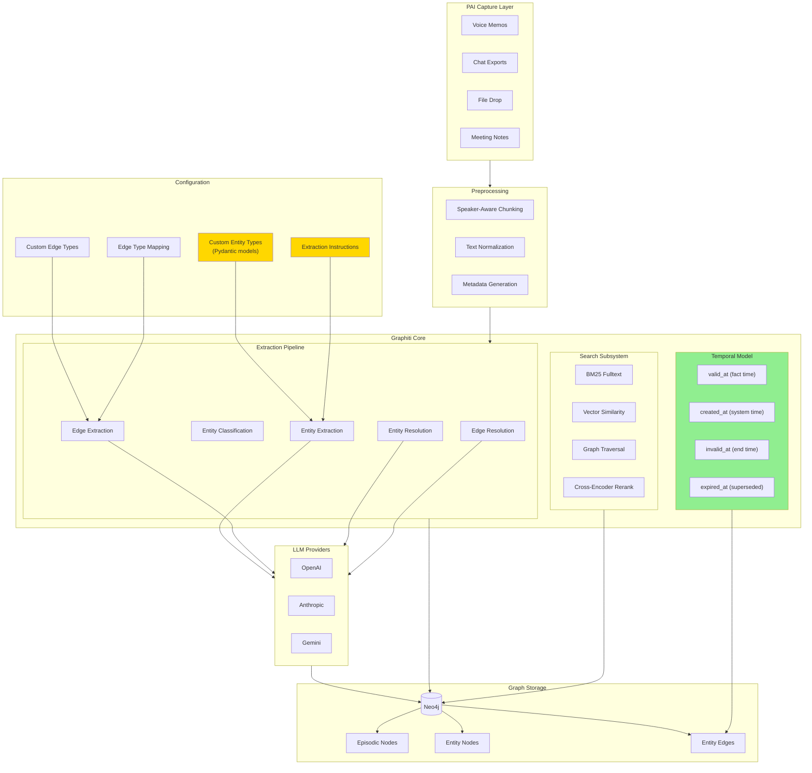

# Graphiti Temporal Knowledge Graph: Comprehensive Deep Dive

**Author:** Architect Agent
**Date:** 2026-01-21
**Version:** 1.0
**Purpose:** Comprehensive architectural analysis for PAI integration

---

## Executive Summary

Graphiti is a temporal knowledge graph library developed by Zep that enables real-time, incremental construction of knowledge graphs from conversational and unstructured data. Unlike traditional RAG approaches that rely on batch processing and static document embeddings, Graphiti maintains a living knowledge graph with bi-temporal tracking, entity resolution, and hybrid search capabilities.

**Key Findings:**

1. **Architecture Quality:** Graphiti exhibits well-designed, modular architecture with clean separation of concerns. The codebase is professionally structured with comprehensive type hints, proper error handling, and extensible interfaces.

2. **Temporal Model:** The bi-temporal data model tracks both `valid_at` (when facts became true in the world) and `created_at` (when facts entered the system), enabling point-in-time queries and contradiction detection.

3. **Extension Points:** Highly configurable via custom Pydantic entity types, edge types, extraction prompts, LLM clients, embedders, and database backends.

4. **Current Limitations:** LLM extraction variance remains a challenge; node attribute versioning is missing; significant LLM cost per ingestion.

5. **PAI Alignment:** Excellent fit for PAI's voice memo capture, chat export, and file drop workflows. The episode-based ingestion model maps naturally to PAI's capture paradigm.

---

## Table of Contents

1. [What is a Temporal Knowledge Graph?](#1-what-is-a-temporal-knowledge-graph)
2. [How Graphiti Works](#2-how-graphiti-works)
3. [Configuration and Extension Points](#3-configuration-and-extension-points)
4. [Limitations and Constraints](#4-limitations-and-constraints)
5. [Architecture Quality Assessment](#5-architecture-quality-assessment)
6. [Roadmap and Open Issues](#6-roadmap-and-open-issues)
7. [PAI-Specific Recommendations](#7-pai-specific-recommendations)
8. [Risk Assessment](#8-risk-assessment)
9. [Architecture Diagram](#9-architecture-diagram)
10. [Comparison Tables](#10-comparison-tables)

---

## 1. What is a Temporal Knowledge Graph?

### Core Concepts

A **knowledge graph** represents information as a network of entities (nodes) connected by relationships (edges). Each entity has properties, and each relationship expresses a semantic connection between entities.

A **temporal knowledge graph** extends this by adding time as a first-class dimension, enabling:

- Historical queries ("What did we know about Project X in Q3?")
- Change tracking ("How has Sarah's role evolved?")
- Contradiction detection ("The new fact conflicts with a previous fact")
- Point-in-time reconstruction ("What was the state of knowledge on January 15th?")

### Bi-Temporal Data Model

Graphiti implements a **bi-temporal model** with two distinct time dimensions:

| Dimension | Field | Purpose | Example |
|-----------|-------|---------|---------|
| **Valid Time** | `valid_at` | When the fact became true in the real world | "Mike joined Anthropic on 2025-03-15" |
| **Transaction Time** | `created_at` | When the fact was recorded in the system | Episode ingested at 2026-01-21T10:30:00Z |
| **Invalidation Time** | `invalid_at` | When the fact ceased to be true | "Mike left Anthropic on 2026-01-10" |
| **Expiration Time** | `expired_at` | When the edge was superseded by new information | System detected contradicting fact |

This enables powerful temporal queries:

```cypher
// What relationships did we know about Mike on January 1st?
MATCH (p:Person {name: "Mike"})-[r]->(x)
WHERE r.created_at <= datetime("2026-01-01")
  AND (r.expired_at IS NULL OR r.expired_at > datetime("2026-01-01"))
RETURN p, r, x
```

### Why Temporality Matters for Knowledge Management

1. **Memory Evolution:** Human knowledge evolves - people change jobs, projects complete, relationships shift. A static graph becomes stale.

2. **Contradiction Resolution:** When "Mike works at Anthropic" conflicts with "Mike joined OpenAI," the temporal model can mark the old fact invalid rather than creating confusion.

3. **Provenance Tracking:** The episode linkage preserves where facts came from, enabling fact verification.

4. **Context Relevance:** Search can prioritize recent facts over ancient ones, or find facts relevant to a specific time period.

### Comparison: Traditional KG vs Temporal KG

| Aspect | Traditional Knowledge Graph | Temporal Knowledge Graph |
|--------|----------------------------|--------------------------|
| Time handling | None or manual timestamps | First-class bi-temporal model |
| Updates | Overwrite or duplicate | Version with validity tracking |
| Contradictions | Create inconsistencies | Explicit invalidation |
| Historical queries | Not supported | Native support |
| Storage overhead | Lower | Higher (versions stored) |
| Query complexity | Simpler | More complex temporal predicates |

---

## 2. How Graphiti Works

### Episode-Based Ingestion Model

Graphiti's fundamental unit of ingestion is the **episode** - a discrete piece of content with temporal metadata:

```python
class EpisodicNode(Node):
    source: EpisodeType          # message, json, or text
    source_description: str       # e.g., "voice-memo", "chat-export"
    content: str                  # raw episode content
    valid_at: datetime            # when content was created
    entity_edges: list[str]       # edges extracted from this episode
```

**Episode Types:**
- `message` - Conversational format: "Speaker: content"
- `json` - Structured JSON data
- `text` - Unstructured plain text

### Entity Extraction Pipeline

When you call `graphiti.add_episode()`, a sophisticated multi-stage pipeline executes:

```
Episode Content
      |
      v
[1. Prompt Construction]
      |
      +---> Entity Types as schema guidance
      +---> Previous episodes for context
      +---> Custom extraction instructions
      |
      v
[2. LLM Extraction]
      |
      +---> Extract entities with type IDs
      +---> Reflexion pass for missed entities
      |
      v
[3. Entity Resolution]
      |
      +---> Similarity search against existing nodes
      +---> LLM deduplication for ambiguous cases
      +---> UUID mapping for merged entities
      |
      v
[4. Attribute Extraction]
      |
      +---> Hydrate entity attributes from context
      +---> Generate entity summaries
      |
      v
[5. Edge Extraction]
      |
      +---> Extract relationships between entities
      +---> Assign temporal metadata (valid_at, invalid_at)
      +---> SCREAMING_SNAKE_CASE relation types
      |
      v
[6. Edge Resolution]
      |
      +---> Check for contradicting existing facts
      +---> Mark old facts as expired if contradicted
      +---> Deduplicate redundant edges
      |
      v
[7. Graph Storage]
      |
      +---> Save Episode node
      +---> Save Entity nodes with embeddings
      +---> Save Entity edges with fact embeddings
      +---> Create MENTIONS edges (Episode -> Entity)
```

### Extraction Prompts

The extraction process uses carefully crafted prompts. Here's the entity extraction prompt structure:

```
<ENTITY TYPES>
{context['entity_types']}  # Custom Pydantic models with docstrings
</ENTITY TYPES>

<PREVIOUS MESSAGES>
{previous_episodes}         # Context for continuity
</PREVIOUS MESSAGES>

<CURRENT MESSAGE>
{episode_content}          # The text being processed
</CURRENT MESSAGE>

Instructions:
1. Speaker Extraction: Always extract the speaker as first entity
2. Entity Identification: Extract explicitly/implicitly mentioned entities
3. Entity Classification: Use ENTITY TYPES to classify
4. Exclusions: No relationships, actions, or temporal data as entities
5. Formatting: Be explicit, use full names

{custom_extraction_instructions}  # Your additional guidance
```

**Critical Insight:** The Pydantic model docstrings ARE the extraction guidance. When you define:

```python
class Person(BaseModel):
    """
    A person mentioned in captures - contacts, collaborators, or references.

    EXTRACTION RULES:
    - ALWAYS extract the FULL NAME when available
    - "Sarah from Legal" and "Sarah from Engineering" are TWO DIFFERENT people
    """
    role: Optional[str] = Field(description="Person's role or title")
```

These docstrings are passed directly to the LLM. More detailed docstrings = better extraction.

### Edge Extraction and Temporal Metadata

Edges (relationships) are extracted with explicit temporal bounds:

```python
class Edge(BaseModel):
    relation_type: str    # SCREAMING_SNAKE_CASE
    source_entity_id: int
    target_entity_id: int
    fact: str             # Natural language description
    valid_at: str | None  # When fact became true (ISO 8601)
    invalid_at: str | None # When fact stopped being true
```

The LLM is instructed:
- Use REFERENCE_TIME to resolve relative expressions ("last week")
- If ongoing (present tense), set valid_at to reference time
- If change/termination expressed, set invalid_at
- Leave null if no explicit time stated

### Hybrid Search Architecture

Graphiti provides sophisticated search combining multiple methods:

```python
class EdgeSearchConfig:
    search_methods: list[EdgeSearchMethod]  # bm25, cosine_similarity, bfs
    reranker: EdgeReranker                  # rrf, mmr, cross_encoder, node_distance
```

**Search Methods:**
1. **BM25 (Full-text):** Keyword-based search on fact text
2. **Cosine Similarity:** Vector similarity on fact embeddings
3. **BFS (Breadth-First Search):** Graph traversal from origin nodes

**Rerankers:**
1. **RRF (Reciprocal Rank Fusion):** Combines rankings from multiple methods
2. **MMR (Maximal Marginal Relevance):** Balances relevance with diversity
3. **Cross-Encoder:** Neural reranking for higher precision
4. **Node Distance:** Prioritizes facts closer to a center node

### Data Model in Neo4j

```
(:Episodic)                  (:Entity)                    (:Entity)
    |                            |                            |
    |--[:MENTIONS]-------------->|--[:RELATES_TO]------------>|
    |                            |                            |
    +-- uuid                     +-- uuid                     +-- uuid
    +-- name                     +-- name                     +-- name
    +-- content                  +-- labels                   +-- labels
    +-- source                   +-- summary                  +-- summary
    +-- source_description       +-- name_embedding           +-- attributes
    +-- valid_at                 +-- attributes
    +-- created_at               +-- created_at
    +-- entity_edges

(:EntityEdge) - stored as relationship property
    +-- uuid
    +-- name (relation type)
    +-- fact
    +-- fact_embedding
    +-- valid_at
    +-- invalid_at
    +-- expired_at
    +-- created_at
    +-- episodes[]
    +-- attributes{}
```

---

## 3. Configuration and Extension Points

### 3.1 Custom Entity Types (PRIMARY TUNING LEVER)

Define domain-specific entity types with Pydantic models:

```python
class Person(BaseModel):
    """
    EXTRACTION RULES in docstring guide LLM...
    """
    role: Optional[str] = Field(description="Person's role")
    organization: Optional[str] = Field(description="Associated organization")

PAA_ENTITY_TYPES = {
    "Person": Person,
    "Concept": Concept,
    "Project": Project,
    # ... your custom types
}
```

**Extension strategy:**
- Add detailed EXTRACTION RULES in docstrings
- Include examples of correct vs incorrect extraction
- Add disambiguation rules for ambiguous cases
- Define attribute fields with descriptive Field() descriptions

### 3.2 Custom Edge Types

```python
class WorksOn(BaseModel):
    """Relationship: Person works on a Project/Concept."""
    role_in_work: Optional[str] = Field(description="Their role")

PAA_EDGE_TYPES = {
    "WORKS_ON": WorksOn,
    "RECOMMENDS": Recommends,
    # ... your edge types
}
```

### 3.3 Edge Type Mapping

Control which edge types can connect which entity types:

```python
PAA_EDGE_TYPE_MAP = {
    ("Person", "Project"): ["WORKS_ON"],
    ("Person", "Concept"): ["RECOMMENDS", "WORKS_ON"],
    ("Task", "Person"): ["ASSIGNED_TO"],
    ("Concept", "Concept"): ["RELATES_TO"],
}
```

### 3.4 Custom Extraction Instructions

Add domain-specific guidance per ingestion:

```python
await graphiti.add_episode(
    name="capture-001",
    episode_body=text,
    custom_extraction_instructions="""
    DOMAIN-SPECIFIC RULES:
    - Extract all monetary amounts as Financial entities
    - "the project" refers to PAI unless specified otherwise
    - Quarter references (Q1, Q2) should be Event entities
    """,
    ...
)
```

### 3.5 LLM Client Configuration

```python
from graphiti_core.llm_client import AnthropicClient, OpenAIClient

# Use Claude for extraction
graphiti = Graphiti(
    uri=NEO4J_URI,
    llm_client=AnthropicClient(model="claude-sonnet-4-20250514"),
    ...
)
```

**Supported LLM Providers:**
- OpenAI (default, best structured output support)
- Anthropic
- Google Gemini
- Groq
- Azure OpenAI
- OpenAI-compatible (Ollama)

### 3.6 Embedding Model Configuration

```python
from graphiti_core.embedder import OpenAIEmbedder, VoyageEmbedder

graphiti = Graphiti(
    uri=NEO4J_URI,
    embedder=OpenAIEmbedder(model="text-embedding-3-small"),
    # or: embedder=VoyageEmbedder(model="voyage-3")
)
```

### 3.7 Database Backend Configuration

```python
from graphiti_core.driver.neo4j_driver import Neo4jDriver
from graphiti_core.driver.falkordb_driver import FalkorDBDriver
from graphiti_core.driver.kuzu_driver import KuzuDriver
from graphiti_core.driver.neptune_driver import NeptuneDriver

# Custom database name
driver = Neo4jDriver(uri="bolt://localhost:7687", database="custom_db")
graphiti = Graphiti(graph_driver=driver, ...)
```

**Supported Backends:**
- Neo4j (5.26+) - Default, most mature
- FalkorDB (1.1.2+) - Redis-based graph
- Kuzu (0.11.2+) - Embedded graph database
- Amazon Neptune - Cloud-native

### 3.8 Concurrency Configuration

```python
# Via environment variable
export SEMAPHORE_LIMIT=20  # Default: 10

# Or via constructor
graphiti = Graphiti(
    uri=NEO4J_URI,
    max_coroutines=20,
    ...
)
```

### 3.9 Cross-Encoder/Reranker Configuration

```python
from graphiti_core.cross_encoder.openai_reranker_client import OpenAIRerankerClient
from graphiti_core.cross_encoder.gemini_reranker_client import GeminiRerankerClient
from graphiti_core.cross_encoder.bge_reranker_client import BGERerankerClient

graphiti = Graphiti(
    uri=NEO4J_URI,
    cross_encoder=OpenAIRerankerClient(),  # or GeminiRerankerClient()
    ...
)
```

### 3.10 Episode Raw Content Storage

```python
graphiti = Graphiti(
    uri=NEO4J_URI,
    store_raw_episode_content=False,  # Don't store episode text (privacy)
    ...
)
```

### 3.11 Saga (Episode Sequencing)

Group related episodes into narrative sequences:

```python
await graphiti.add_episode(
    name="meeting-part-1",
    episode_body="First part of meeting...",
    saga="Q1-Planning-Meeting",  # Creates/joins saga
    ...
)

await graphiti.add_episode(
    name="meeting-part-2",
    episode_body="Second part...",
    saga="Q1-Planning-Meeting",
    saga_previous_episode_uuid=result.episode.uuid,  # Efficient linking
    ...
)
```

### Configuration Summary Table

| Configuration | Location | Impact | Complexity |
|--------------|----------|--------|------------|
| Entity type docstrings | Pydantic models | **Highest** | Low |
| Custom extraction instructions | add_episode() | High | Low |
| Edge type definitions | Pydantic models | Medium-High | Low |
| Edge type mapping | PAA_EDGE_TYPE_MAP | Medium | Low |
| LLM client | Constructor | Medium | Medium |
| Embedder | Constructor | Medium | Medium |
| Database backend | Constructor | Low (operational) | High |
| Concurrency limit | Env var/Constructor | Low | Low |
| Cross-encoder | Constructor | Low | Medium |

---

## 4. Limitations and Constraints

### 4.1 LLM Extraction Variance

**Problem:** The same input text can produce different extractions on different runs.

**Root Causes:**
- LLM temperature/sampling
- Ambiguous text interpretation
- Context window variations

**Mitigation Strategies:**
- Use structured output mode (OpenAI/Gemini best)
- Add explicit extraction examples in docstrings
- Implement post-processing validation
- Consider deterministic caching layer

### 4.2 Node Attribute Versioning Gap (Issue #1166)

**Problem:** Entity node properties are destructively overwritten during updates. Historical attribute values are lost.

**Example:**
```
Episode 1: "Mike is a senior engineer at Anthropic"
  -> Mike: {role: "senior engineer", organization: "Anthropic"}

Episode 2: "Mike was promoted to Staff Engineer"
  -> Mike: {role: "Staff Engineer", organization: "Anthropic"}
  # Previous "senior engineer" lost!
```

**Status:** Open issue, acknowledged by maintainers.

**Workaround:** Store historical attributes in episode-linked facts rather than node properties.

### 4.3 Cost Implications

**LLM Calls Per Ingestion:**

| Stage | LLM Calls | Purpose |
|-------|-----------|---------|
| Entity extraction | 1-3 | Extract entities, reflexion |
| Entity classification | 1 | Assign types |
| Entity deduplication | 0-N | Resolve ambiguous matches |
| Attribute extraction | N | One per entity |
| Summary extraction | N | One per entity |
| Edge extraction | 1-3 | Extract relationships, reflexion |
| Edge resolution | 0-N | Check contradictions |

**Approximate cost for 1000-word episode:**
- ~10-20 LLM calls
- ~$0.10-0.50 USD (Claude Sonnet / GPT-4)
- ~$0.01-0.05 USD (GPT-4o-mini)

**Mitigation:**
- Use smaller models for classification/deduplication
- Batch episodes with `add_episode_bulk()`
- Configure `excluded_entity_types` to reduce extraction

### 4.4 Query Complexity

**Challenge:** Temporal queries require understanding bi-temporal predicates.

**Example - "What did we know about Mike last month?":**
```cypher
MATCH (p:Person {name: "Mike"})-[r]->(x)
WHERE r.created_at <= datetime("2025-12-21")
  AND (r.expired_at IS NULL OR r.expired_at > datetime("2025-12-21"))
  AND (r.valid_at IS NULL OR r.valid_at <= datetime("2025-12-21"))
  AND (r.invalid_at IS NULL OR r.invalid_at > datetime("2025-12-21"))
RETURN r.fact
```

**Mitigation:** Build query helper functions abstracting temporal logic.

### 4.5 Scalability Considerations

| Aspect | Current Behavior | Scalability Impact |
|--------|-----------------|-------------------|
| Entity resolution | O(N) similarity search | Degrades with graph size |
| Episode retrieval | Retrieves last N episodes | Fixed window, manageable |
| BFS search | Graph traversal | Bounded by depth limit |
| Embedding storage | Per-node vectors | Neo4j handles well |

**Recommendations:**
- Use `group_id` partitioning for multi-tenant/multi-domain
- Configure appropriate `EPISODE_WINDOW_LEN` (default: 100)
- Monitor Neo4j index performance
- Consider read replicas for search-heavy workloads

### 4.6 What Graphiti Cannot Do

1. **Real-time streaming** - Designed for episode-by-episode ingestion, not continuous streams
2. **Multi-modal content** - Text only; no native image/audio entity extraction
3. **Probabilistic reasoning** - No built-in uncertainty quantification
4. **Automated schema discovery** - Entity types must be predefined
5. **Cross-graph federation** - Single graph database at a time

---

## 5. Architecture Quality Assessment

### 5.1 Code Organization

**Rating: Excellent (9/10)**

```
graphiti_core/
├── graphiti.py           # Main Graphiti class
├── nodes.py              # Node models (Episodic, Entity, Community, Saga)
├── edges.py              # Edge models (Episodic, Entity, Community)
├── driver/               # Database backends
│   ├── driver.py         # Abstract interface
│   ├── neo4j_driver.py   # Neo4j implementation
│   ├── falkordb_driver.py
│   ├── kuzu_driver.py
│   └── neptune_driver.py
├── llm_client/           # LLM providers
│   ├── client.py         # Abstract interface
│   ├── openai_client.py
│   ├── anthropic_client.py
│   └── ...
├── embedder/             # Embedding providers
├── cross_encoder/        # Reranking providers
├── prompts/              # LLM prompt templates
│   ├── extract_nodes.py
│   ├── extract_edges.py
│   └── ...
├── search/               # Search subsystem
│   ├── search.py         # Main search orchestration
│   ├── search_config.py  # Configuration models
│   └── search_utils.py   # Search implementations
└── utils/
    ├── bulk_utils.py     # Bulk ingestion
    └── maintenance/      # Graph maintenance ops
```

**Strengths:**
- Clean separation between domain models and infrastructure
- Consistent use of abstract interfaces for pluggability
- Logical grouping of related functionality
- Type hints throughout

### 5.2 Extensibility Design

**Rating: Excellent (9/10)**

**Pluggable Components:**
- Database drivers (GraphDriver interface)
- LLM clients (LLMClient interface)
- Embedders (EmbedderClient interface)
- Cross-encoders (CrossEncoderClient interface)

**Extension Patterns:**
```python
# Adding a new LLM provider
class MyLLMClient(LLMClient):
    async def generate_response(self, messages: list[Message]) -> str:
        # Implementation

    async def generate_response_with_model(
        self, messages: list[Message], response_model: type[T]
    ) -> T:
        # Structured output implementation
```

**Entity/Edge Extensibility:**
- Pydantic models with Field() descriptions
- Docstrings serve as LLM guidance
- Attribute extraction honors model schema

### 5.3 Error Handling

**Rating: Good (7/10)**

**Strengths:**
- Custom exception hierarchy (NodeNotFoundError, EdgeNotFoundError, etc.)
- Graceful telemetry failure handling
- Try/finally patterns for resource cleanup

**Weaknesses:**
- Some bare except clauses
- LLM failure recovery could be more robust
- Rate limiting errors not always distinguished

### 5.4 Testing Coverage

**Rating: Moderate (6/10)**

**Observed:**
- Unit tests for core functionality
- Integration tests with Neo4j
- No comprehensive extraction accuracy tests

**Missing:**
- Property-based testing for temporal logic
- Extraction regression tests
- Performance benchmarks

### 5.5 Documentation Quality

**Rating: Good (7/10)**

**Strengths:**
- Comprehensive docstrings on public methods
- Type hints throughout
- README with quickstart

**Weaknesses:**
- Limited architecture documentation
- Few worked examples for complex scenarios
- Temporal query patterns underdocumented

---

## 6. Roadmap and Open Issues

### 6.1 Critical Issues Affecting PAI

| Issue | Impact | Status | Workaround |
|-------|--------|--------|------------|
| #1166 Node attribute versioning | Historical data loss | Open | Store in edges |
| #1164 "attributes" keyword in MCP | Silent failures | Open | Avoid in input |
| #1143 Neo4j schema index error | Startup crashes | Open | Manual index fix |
| #1128 Custom edge types in FalkorDB | All edges become RELATES_TO | Open | Use Neo4j |

### 6.2 Planned Features (from Issues/PRs)

| Feature | Issue/PR | Impact for PAI | Priority |
|---------|----------|----------------|----------|
| Summary embeddings for semantic search | #1163 | Better entity search | High |
| Configurable small model | #1135, #1155 | Cost reduction | High |
| Multi-language support | #1141 | Future i18n | Medium |
| Attribute extraction inline | #1131 | Performance | Medium |
| Orphaned entity cleanup | #1130 | Graph hygiene | Low |
| Environment variable standardization | #1165 | Deployment | Low |

### 6.3 Roadmap Alignment with PAI Needs

| PAI Need | Graphiti Status | Gap |
|----------|-----------------|-----|
| Voice memo capture | Supported via text episodes | None |
| Chat export processing | Supported via message episodes | None |
| File drop ingestion | Supported via text/json episodes | None |
| Person disambiguation | Entity resolution exists | Needs docstring tuning |
| Project tracking | Entity type support | None |
| Task extraction | Supported | Needs verb-phrase docstring work |
| Temporal queries | Bi-temporal model | Query helper functions needed |
| Historical reconstruction | Edges supported, nodes partial | Node versioning gap |
| Graph visualization | Not built-in | Need external tool |

---

## 7. PAI-Specific Recommendations

### 7.1 Immediate Optimizations

**1. Enhance Relationship F1 (Currently 68.7%)**

Focus on edge type docstrings with explicit examples:

```python
class AssignedTo(BaseModel):
    """
    Relationship: Task is assigned to a Person.

    EXTRACTION RULES:
    - "Marcus to review PRs" -> Task(review PRs) ASSIGNED_TO Person(Marcus)
    - "Lisa will deploy" -> Task(deploy) ASSIGNED_TO Person(Lisa)
    - Direction is ALWAYS Task -> Person

    DO NOT extract if no specific person mentioned.
    """
    assigned_context: Optional[str] = Field(...)
```

**2. Add Post-Processing Validation**

Create a validation layer after Graphiti extraction:

```python
async def validate_extraction(result: AddEpisodeResults) -> AddEpisodeResults:
    for node in result.nodes:
        # Validate Task names are verb phrases
        if "Task" in node.labels:
            if not starts_with_verb(node.name):
                # Log and potentially correct
                pass
    return result
```

**3. Expand Ground Truth Dataset**

Current 10 test cases should grow to 50+:
- Add edge case scenarios
- Add multi-entity relationship tests
- Add temporal reference tests
- Add disambiguation stress tests

### 7.2 Medium-Term Improvements

**1. Implement Entity Resolution Cache**

```python
class EntityResolutionCache:
    """
    Store canonical entity mappings to prevent re-extraction drift.
    """
    def get_canonical(self, name: str, entity_type: str) -> Optional[str]:
        # Return UUID of existing entity if confident match
        pass

    def register(self, name: str, entity_type: str, uuid: str):
        # Store new canonical mapping
        pass
```

**2. Add Domain-Specific Entity Types**

For PAI workflows:

```python
class Skill(BaseModel):
    """A PAI skill or capability that can be invoked."""
    skill_type: Optional[str] = Field(description="Type: command, workflow, agent")
    invocation: Optional[str] = Field(description="How to invoke: /command, workflow name")

class Workflow(BaseModel):
    """A multi-step process or automation."""
    status: Optional[str] = Field(description="active, draft, deprecated")
    triggers: Optional[str] = Field(description="What triggers this workflow")
```

**3. Build Temporal Query Helpers**

```python
async def get_knowledge_at(
    graphiti: Graphiti,
    entity_name: str,
    at_time: datetime
) -> dict:
    """Get what PAI knew about an entity at a specific time."""
    # Handle bi-temporal predicates
    pass

async def get_changes_between(
    graphiti: Graphiti,
    entity_name: str,
    start: datetime,
    end: datetime
) -> list[dict]:
    """Get all knowledge changes about an entity in a time range."""
    pass
```

### 7.3 Long-Term Architecture

**1. Consider Hybrid Storage**

- Graphiti/Neo4j for relationship graph
- Vector store (Qdrant/Pinecone) for dense retrieval
- SQLite for structured metadata

**2. Implement Confidence Scoring**

Add extraction confidence to enable review workflows:

```python
class ExtractionResult:
    entity: EntityNode
    confidence: float  # 0.0 to 1.0
    extraction_source: str  # which prompt/model

    def needs_review(self) -> bool:
        return self.confidence < 0.8
```

**3. Build Graph Visualization Layer**

Integrate with Neo4j Bloom or custom D3.js visualization for knowledge exploration.

---

## 8. Risk Assessment

### 8.1 Technical Risks

| Risk | Likelihood | Impact | Mitigation |
|------|------------|--------|------------|
| LLM API rate limiting | High | Medium | Implement backoff, use bulk ingestion |
| Extraction accuracy degradation | Medium | High | Automated regression testing |
| Neo4j scaling issues | Low | High | Monitor, partition with group_id |
| Graphiti breaking changes | Medium | Medium | Pin versions, test before upgrade |
| Node versioning gap | High | Medium | Store history in edges until fixed |

### 8.2 Operational Risks

| Risk | Likelihood | Impact | Mitigation |
|------|------------|--------|------------|
| LLM cost overruns | Medium | Medium | Cost monitoring, smaller models |
| Neo4j availability | Low | High | Docker health checks, backups |
| Data consistency issues | Medium | Medium | Validation layer, ground truth tests |
| Performance degradation at scale | Medium | Medium | Benchmarking, index optimization |

### 8.3 Strategic Risks

| Risk | Likelihood | Impact | Mitigation |
|------|------------|--------|------------|
| Graphiti project abandonment | Low | High | Fork capability, abstraction layer |
| Better alternative emerges | Medium | Low | Abstraction layer enables migration |
| Neo4j licensing changes | Low | Medium | FalkorDB/Kuzu as fallbacks |

---

## 9. Architecture Diagram



---

## 10. Comparison Tables

### 10.1 Graphiti vs Alternatives

| Feature | Graphiti | LangChain Graphs | LlamaIndex KG | Microsoft GraphRAG |
|---------|----------|------------------|---------------|-------------------|
| Temporal model | Bi-temporal | None | None | None |
| Incremental updates | Real-time | Batch | Batch | Batch |
| Entity resolution | LLM-assisted | Basic | Basic | Community-based |
| Custom entity types | Pydantic models | Schema-based | Schema-based | Fixed |
| Query latency | Sub-second | Variable | Variable | Higher |
| LLM dependency | Heavy | Medium | Medium | Heavy |
| Cost per ingestion | Higher | Lower | Lower | Higher |
| Graph backends | 4 options | Neo4j only | Multiple | Custom |

### 10.2 Current Capabilities vs PAI Needs

| PAI Need | Current Capability | Gap | Priority |
|----------|-------------------|-----|----------|
| Voice memo capture | Episode ingestion | None | - |
| Entity extraction | 88.3% F1 | 12% improvement possible | High |
| Relationship extraction | 68.7% F1 | 31% improvement needed | High |
| Person disambiguation | Entity resolution | Needs tuning | High |
| Task tracking | Task entity type | Verb-phrase extraction | Medium |
| Temporal queries | Bi-temporal edges | Query helpers needed | Medium |
| Graph visualization | None | External tool needed | Low |
| Historical reconstruction | Edges only | Node versioning gap | Medium |

### 10.3 Configuration Impact Matrix

| Configuration | Extraction F1 | Performance | Cost | Complexity |
|--------------|---------------|-------------|------|------------|
| Entity type docstrings | +++++ | = | = | Low |
| Custom instructions | +++ | = | + | Low |
| Edge type docstrings | ++++ | = | = | Low |
| LLM model choice | ++ | -- | +++++ | Medium |
| Embedder choice | + | - | ++ | Medium |
| Concurrency limit | = | ++++ | = | Low |
| Group partitioning | = | ++ | = | Medium |

---

## Appendix A: Quick Reference

### A.1 File Locations (PAI)

```
~/.claude/tools/
├── GraphitiIngest.py        # Main ingestion script
├── GraphitiQuery.py         # Query interface
├── lib/
│   └── graphiti_types.py    # Custom entity/edge types (PRIMARY TUNING)
└── tuning/
    ├── TuningLoop.py        # Evaluation framework
    ├── ground_truth.json    # Test cases
    └── baseline_scores.json # Performance baseline
```

### A.2 Key Commands

```bash
# Ingest text
python ~/.claude/tools/GraphitiIngest.py "Meeting with Mike about architecture"

# Query graph
python ~/.claude/tools/GraphitiQuery.py search "Mike"
python ~/.claude/tools/GraphitiQuery.py stats
python ~/.claude/tools/GraphitiQuery.py timeline --days 7

# Run tuning evaluation
python ~/.claude/tools/tuning/TuningLoop.py --verbose
python ~/.claude/tools/tuning/TuningLoop.py --compare
```

### A.3 Environment Variables

```bash
# Required
NEO4J_URI=bolt://localhost:7687
NEO4J_USER=neo4j
NEO4J_PASSWORD=your_password
OPENAI_API_KEY=sk-...

# Optional
SEMAPHORE_LIMIT=10                    # Concurrent operations
GRAPHITI_TELEMETRY_ENABLED=false      # Disable telemetry
GRAPHITI_INGEST_ENABLED=true          # Enable PAI ingestion
```

---

## Conclusion

Graphiti represents a well-architected solution for temporal knowledge graph construction from unstructured data. Its bi-temporal model, extensible architecture, and hybrid search capabilities make it an excellent fit for PAI's knowledge management needs.

The primary areas requiring attention are:
1. **Improving extraction accuracy** through enhanced entity/edge type docstrings
2. **Building query helpers** to abstract temporal complexity
3. **Monitoring and mitigating** the node attribute versioning gap
4. **Cost management** through model selection and batching

With these considerations addressed, Graphiti can serve as a robust foundation for PAI's evolving knowledge infrastructure.

---

*Generated by Architect Agent - 2026-01-21*
